  <picture>
    <source media="(prefers-color-scheme: dark)" srcset="assets/banner-dark.svg">
    
  </picture>

# Efficiency Playbook

An evidence-based, token-efficient setup for **Claude Code** and **Codex** on Windows, packaged as one plugin that works in both. Install the plugin, type its setup command, and the agent inspects your configuration and applies the playbook for its tool, asking before each change. Each playbook's Part 2 records every tool, plugin and setting that was evaluated, with its verdict and evidence (for example, why RTK is skipped).

Unofficial; not affiliated with Anthropic or OpenAI. Canonical repo: https://github.com/MrHashMe/efficiency-playbook (renamed from `claude-code-efficiency-setup`; old links redirect). Don't install forks or copies from elsewhere.

| | Claude Code | Codex |
| --- | --- | --- |
| Playbook | [PLAYBOOK.md](PLAYBOOK.md) (v7.3) | [PLAYBOOK-CODEX.md](PLAYBOOK-CODEX.md) (v1.0) |
| Setup command | `/efficiency-playbook:setup` | `$efficiency-playbook:setup` in the CLI; `@` in the ChatGPT desktop app |
| Where it runs | Terminal, VS Code, Desktop Code tab | CLI and the ChatGPT desktop app. The IDE extension can't run plugins, but it uses the result |
| Requires | Windows 10 or 11, Claude Code v2.1.284 or later, Git for Windows | Windows 10 or 11, Codex CLI 0.158.0 or later (also needed to add the plugin when you use the ChatGPT desktop app), Git for Windows |

## Install

### Claude Code

Two commands, run once each and in this order: the first adds this repo as a plugin source (a "marketplace"), the second installs the plugin from it. In PowerShell:

    claude plugin marketplace add MrHashMe/efficiency-playbook
    claude plugin install efficiency-playbook@efficiency-playbook

In a Claude Code terminal session (v2.1.275 or later), this one line does both. Confirm adding the marketplace, then choose **Install for you (user scope)**:

    /plugin install efficiency-playbook --marketplace MrHashMe/efficiency-playbook

A user-scope install is shared by the terminal, VS Code and Desktop on the same computer.

- **VS Code.** Type `/plugins`, add `MrHashMe/efficiency-playbook` on the **Marketplaces** tab, then install `efficiency-playbook` from the **Plugins** tab with **Install for you**.
- **Desktop app.** `/plugin` lines don't run in the Code tab, and its plugin browser (**+ → Plugins → Add plugin**) lists only marketplaces you've already added. Run the two PowerShell lines above once (they need the Claude Code CLI: `winget install --id Anthropic.ClaudeCode -e --scope user`, then open a new PowerShell window), then fully quit and reopen Desktop. We don't recommend **Customize → Plugins** for this plugin: it adds it to your whole claude.ai account, including Cowork and Chat, where setup can't run.
- **Pinning.** Add `#v7.4.0` after the repo name. A pinned install stays on that release, and `claude plugin update` reports it as up to date. To move to a newer release, run `claude plugin marketplace remove efficiency-playbook` (this uninstalls the plugin, not your setup), add it again with the new tag, install, and run `/efficiency-playbook:setup`.

### Codex

In a terminal, run these once each, in this order, then start a new Codex session:

    codex plugin marketplace add MrHashMe/efficiency-playbook
    codex plugin add efficiency-playbook@efficiency-playbook

Instead of the second line, you can type `/plugins` in the Codex CLI and install it from the efficiency-playbook tab. No `codex` command yet? Install the CLI with `npm install -g @openai/codex` (needs Node.js).

- **ChatGPT desktop app.** The app and the CLI share the Codex home (`%USERPROFILE%\.codex`), so after the two lines above, fully quit and reopen the app. The app's own **Add marketplace** screen has an open bug on Windows ([openai/codex#21959](https://github.com/openai/codex/issues/21959)), so use the CLI lines.
- **IDE extension.** It doesn't load plugins. Run the setup once from the CLI or the app; the extension then uses the same global rules, config and skills.
- **Pinning.** Each time Codex starts, it checks this repo and, if `main` has a new commit, reinstalls the plugin from it. To stay on one release, add it as `MrHashMe/efficiency-playbook@v7.4.0` instead (if you already added it, first run `codex plugin marketplace remove efficiency-playbook`). A pinned install doesn't update on its own or with `codex plugin marketplace upgrade`. To move to a newer release, run `codex plugin marketplace remove efficiency-playbook`, add it again with the new tag, then run `codex plugin add efficiency-playbook@efficiency-playbook`.

### Without the plugin

Download `PLAYBOOK.md` (Claude Code) or `PLAYBOOK-CODEX.md` (Codex) from the [latest release](https://github.com/MrHashMe/efficiency-playbook/releases/latest), open a new session in your project, and say: `Read <full path to the file> up to "## Part 2" and execute Part 1.` Changes then go through the agent's normal permission prompts only.

## First run

**Claude Code**
1. Open a new session in a project folder (Part 1 also sets up that project).
2. Type `/efficiency-playbook:setup`, approve each change, and answer the three questions at the end.
3. Paste each line Claude gives you as its own message (Ponytail, one per language server, optionally Context7). Where `/plugin` lines don't run (Desktop, the VS Code panel), install the same plugins from the plugin browser after adding each plugin's marketplace (Claude says how), or from `/plugins` instead.
4. Fully quit and reopen Desktop or VS Code (every window), or open a new terminal window, then type `/setup-check`.

**Codex**
1. Open a Codex session in a project folder, and trust the folder if Codex asks.
2. Type `$efficiency-playbook:setup` (in the app, type `@` and pick the plugin's setup skill), approve each change and each write outside the project, and answer the four questions at the end.
3. Start a new thread (fully quit and reopen the app if it changed `config.toml`), then type `$setup-check`. In each other repo, `$project-setup` adds that repo's command map.

## What it changes

Only what you approve, and it backs up every file it edits and records each change in a `MANIFEST.json` for rollback.

**Claude Code**
- A working-rules file in `~/.claude/rules/` and a marked section in the project's `CLAUDE.md`
- Four user skills: `/project-setup`, `/setup-check`, `/memory-lint` and `/paired-check` (with its runner)
- One `SessionStart` hook in `~/.claude/settings.json` that offers project setup once per repo, and a `PONYTAIL_SUBAGENT_MATCHER` entry in its `env` block
- The optional settings from the three questions at the end (auto-compaction cap, default permission mode, advisor)
- User-level installs of what's missing: Git for Windows and Node.js LTS (with winget), and the language-server programs for your repo's languages. If Node's global npm folder sits inside its versioned install folder, the npm prefix moves to `%APPDATA%\npm`, which is added to your user PATH.
- Plugins (Ponytail, the language-server plugins, optionally Context7, and frontend-design for a new web frontend, in that repo only) are installed by lines you paste yourself.

**Codex**
- A short working-rules block in `~/.codex/AGENTS.md`, and a marked command-map section in the project's `AGENTS.md` (instead of `/init`)
- Two skills in `~/.agents/skills` that run only when you invoke them: `$project-setup` and `$setup-check`
- The `config.toml` keys you choose from the four questions: Standard instead of Fast mode by default (Fast costs 2.5x credits), auto-review of sandbox escalations, keeping variables named like KEY, SECRET or TOKEN out of the commands Codex runs, and a Context7 server
- Nothing else: no hooks, plugins or programs. Ponytail, LSP bridges and the other add-ons in the playbook's Part 2 aren't installed on Codex, because no test shows they help there.

## Privacy

The plugin itself has no hooks, MCP servers or network calls, and its setup command only runs when you type it. Context7 is optional on both tools. If you add it, each lookup sends a library name and a short question the agent writes, plus your IP address and client name, to Upstash, which keeps the questions for its benchmarks, keeps API logs for 30 days, and has OpenAI, Google and Anthropic models rank the results.

## Update

- **Claude Code.** In PowerShell, run `claude plugin update efficiency-playbook@efficiency-playbook` (or, in a terminal session, `/plugin` → **Installed** → **Update now**). Auto-update is off for third-party marketplaces; in a terminal session you can turn it on under `/plugin` → **Marketplaces** → efficiency-playbook → **Enable auto-update**.
- **Codex.** Codex updates the plugin by itself at startup unless you pinned a tag (see Pinning); `codex plugin marketplace upgrade efficiency-playbook` checks now.

After an update, run the setup command again in a new session, then the setup check. To hear about releases, use **Watch → Custom → Releases** on GitHub.

## Uninstall

**Claude Code**
1. Type `/efficiency-playbook:setup rollback` and approve what it removes. It removes what its manifest records, except Git, Node, the npm prefix and PATH change, and your `/paired-check` data, which stay unless you ask. The `CLAUDE.md` sections that `/project-setup` later added to other repos stay.
2. In PowerShell, run `claude plugin marketplace remove efficiency-playbook` (or, in a terminal session, `/plugin marketplace remove efficiency-playbook`). This also uninstalls the plugin. In Desktop, **+ → Plugins → Manage plugins** uninstalls the plugin but leaves the marketplace registered.
3. Fully quit and reopen Desktop.

**Codex**
1. Type `$efficiency-playbook:setup rollback` and approve what it removes. It removes the blocks, skills and `config.toml` keys its manifest records, and puts back each key's earlier value. The `AGENTS.md` sections that `$project-setup` later added to other repos stay.
2. In a terminal, run `codex plugin remove efficiency-playbook@efficiency-playbook`, then `codex plugin marketplace remove efficiency-playbook`.
3. Start a new thread (fully quit and reopen the app).

## Not supported

macOS, Linux, WSL, cloud sessions and Codex cloud tasks, Claude Cowork and Chat. The playbooks are written for native Windows; on other systems the setup command stops and asks first.

## License

MIT, for the author's own text and code. Third-party material quoted or summarized in the playbooks' Part 2 belongs to its owners.

## Maintaining

`node scripts/check.mjs` checks that the bundled runner matches the Claude Code playbook, each playbook's version markers agree, both plugin manifests share one name and version, and nothing loads into every session. CI also installs the plugin into a throwaway Codex home and checks that its setup skill stays out of the model's prompt. Bump `version` in `.claude-plugin/plugin.json` and `.codex-plugin/plugin.json` for every release, since Claude Code installs only update when it changes, then tag `v<version>`; CI publishes the release with both playbooks attached. Codex is different: each time it starts, it reinstalls unpinned copies from the latest commit on `main` whether or not `version` changed, so anything pushed to `main` reaches those users.
